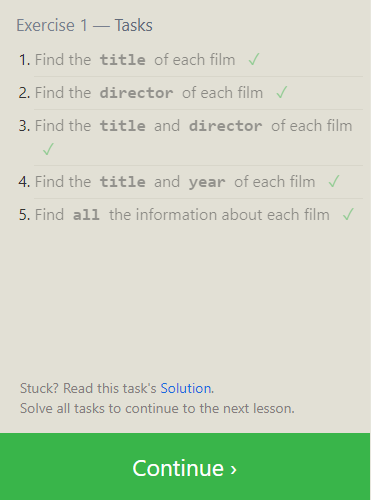

### Task 1

### Task 2

.png>)

### Task 3

.png>)

### Task 4

.png>)

### Task 5

.png>)

### Task 6

.png>)

### Task 13

.png>)

### Task 14

.png>)

### Task 15

.png>)

### Task 16

.png>)

### Task 17

.png>)

### Task 18

.png>)
